<p align="center"><a href="https://www.koombea.com/" target="_blank"></a></p>

## Koombea Challenge - Contact Importer with Laravel by Diego Torres 👋

This is a technical test to import contacts keeping in mind some rules that you may read [here](RFC.md).


## ✨ Demo

On the other hand, you may be interested to try this demo out, so feel free to do it here: [http://contacts-manager-freelancercontracts166926.codeanyapp.com/](http://contacts-manager-freelancercontracts166926.codeanyapp.com/){:target="\_blank"}

By the way, i decided to use https://codeanywhere.com/ to deploy my demo

## What you are going to get

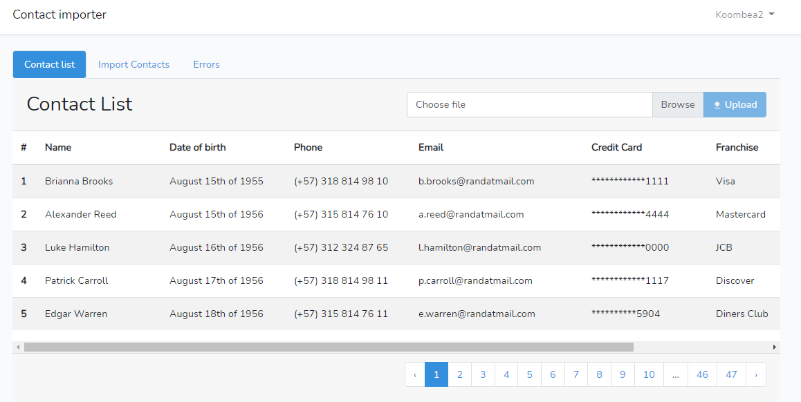

This is the prototype preview of contact importer developed with Laravel 8 in PHP.


## Do you need to run it locally?

PHP, MYSQL & Apache or Nginx server are required.

To run this demo in your local environment, please keep in mind the next.

- Create a database locally named koombea utf8_general_ci
- Download composer https://getcomposer.org/download/

- Clone this repository

    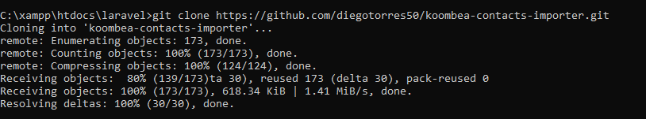

- Open the console and cd your project root directory
- Run 
    ```composer install or php composer.phar install```

    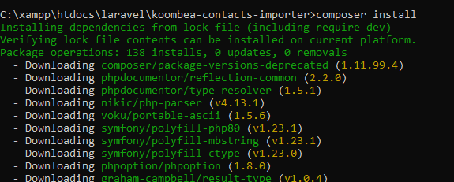

- Run 
    ```php artisan key:generate```

    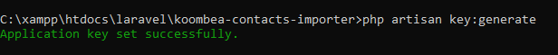

- Rename the file .env.example to .env in project root and make sure to set the right and existing database name as shown below

    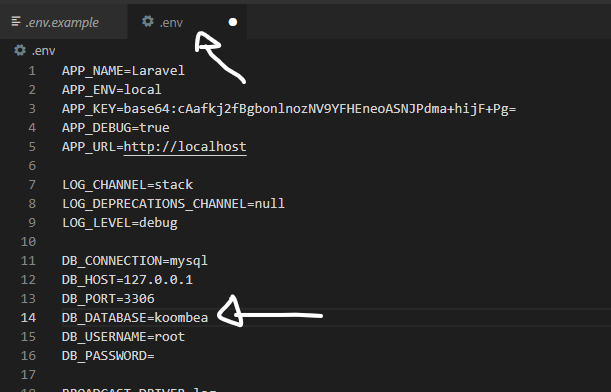

- Run 
    ```php artisan migrate```

    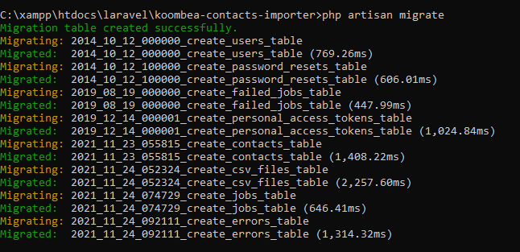

- Run 
    ```php artisan serve```

    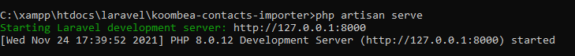
    
**And Bingo!!!**

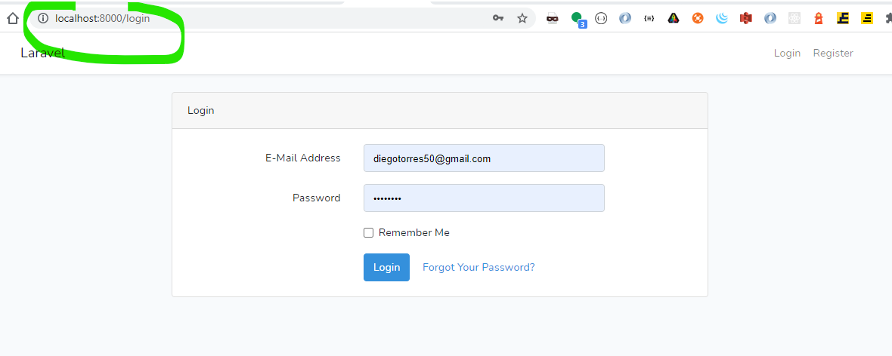

if you are going to import large files with many records, i suggest to run queues, like so:

```php artisan queue:work```


## How to use it

#### Demo CSV files

By the way, if you have no time to make csv files to test, no worries, please, feel free to dowload some files already to use localed in demo_csv_files directory of this project, just click [here](demo_csv_files), even if you wish, download csv_files_sample.zip there.

You may find several samples:

- **Successful contact records**: sample_200_records.csv, sample_50_records.csv and sample_5_records.csv

- **Failed contact records**: sample_10_records_witherrors.csv, with this sample you may test how some incorrect records are skipped and recorded in errors log

#### You need to be autheticated


You may use next credentials to log in application:

    - User: koombea2@koombea.co
    - Pass: 12345678

However, i recommend to register your user:

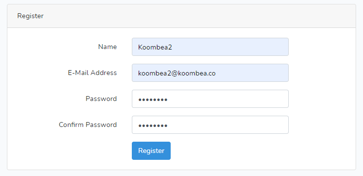


#### Import your contacts

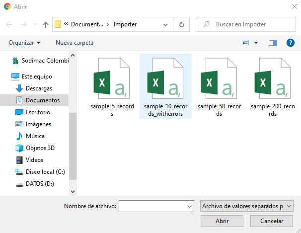

Once logged, you may click on Contact list button

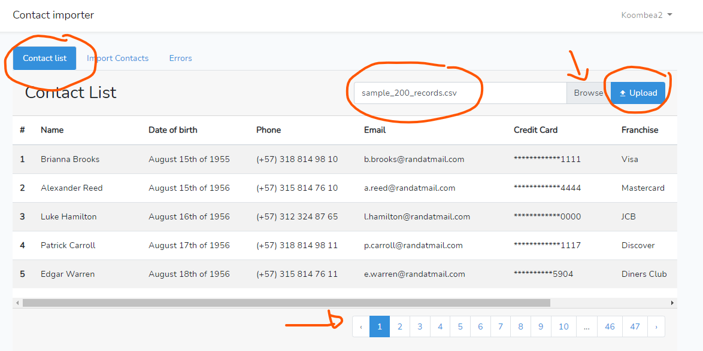

Pickup a CSV format file (separated values by semicolon ";") with click on Browse button and finally click on Upload button as shown above. 


#### View importing history

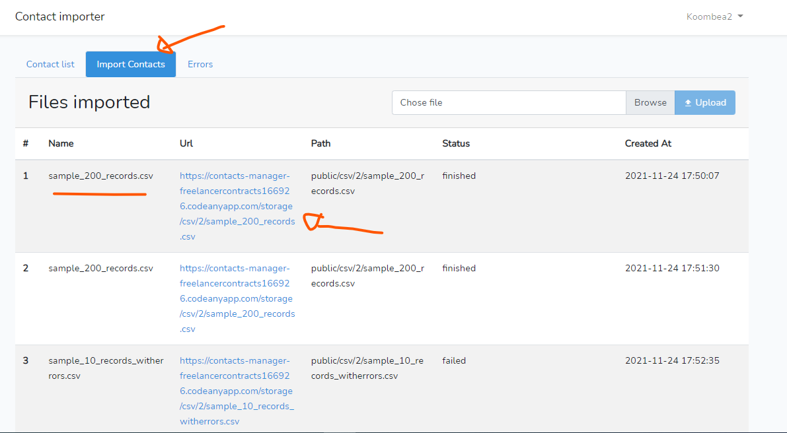

To see importing files history, you may click on Import Contacts


#### Monitor errors

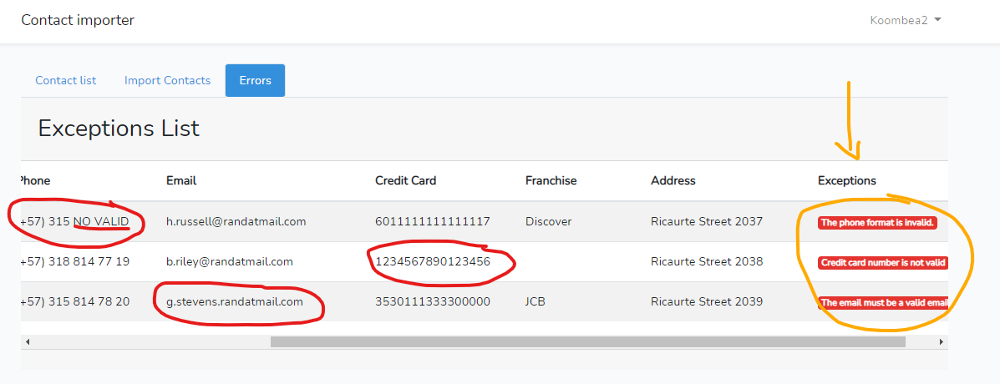

In case you got errors while importing files, you may click on Errors button to see a log.


## Author

👤 **Diego Torres**

- Linkedin: [https://www.linkedin.com/in/diegotorrescampuzano/](https://www.linkedin.com/in/diegotorrescampuzano/)


## Code Contributors

#### Why invent the wheel?

I decided to use some third-party libraries to solve credit card validations and excel file manipulation and i think that they deserve the credit :)

- **PHP Credit Cards**: A PHP package to perform operations on debit and credit cards like format, validate brand, number and Luhn algorithm. It validates popular brands like Visa, Mastercard, American Express, etc. 

    This package is based on the braintree/credit-card-type javascript package. All the card types configuration have been extracted from it.

    You may find further information in here: https://github.com/jlorente/php-credit-cards

- **Laravel Excel**: 🚀 Laravel Excel is intended at being Laravel-flavoured PhpSpreadsheet: a simple, but elegant wrapper around PhpSpreadsheet with the goal of simplifying exports and imports.

    🔥 **PhpSpreadsheet** is a library written in pure PHP and providing a set of classes that allow you to read from and to write to different spreadsheet file formats, like Excel and LibreOffice Calc.

    You may find further information in here: https://laravel-excel.com/    

---

_Thanks so much Koombea ❤️_
