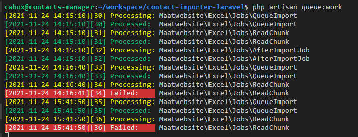
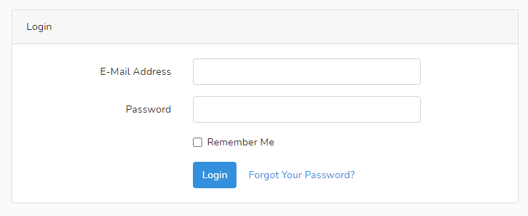

<p align="center"><a href="https://www.koombea.com/" target="_blank"></a></p>

## Koombea Challenge - Contact Importer with Laravel by Diego Torres 👋

This is a technical test to import contacts keeping in mind some rules that you may read [here](RFC.md).

On the other hand, you may be interested to try this demo out, so feel free to do it here: http://contacts-manager-freelancercontracts166926.codeanyapp.com/ 

## What you are going to get


This is the prototype preview of contact importer developed with Laravel 8 in PHP.


## Do you need to run it locally?

PHP, MYSQL & Apache or Nginx server are required.

To run this demo in your local environment, please keep in mind the next.

- Create a database locally named koombea utf8_general_ci
- Download composer https://getcomposer.org/download/

- Clone this repository

    

- Open the console and cd your project root directory
- Run 
    ```composer install or php composer.phar install```

    

- Run 
    ```php artisan key:generate```

    

- Rename the file .env.example to .env in project root and make sure to set the right and existing database name as shown below

    

- Run 
    ```php artisan migrate```

    

- Run 
    ```php artisan serve```

    
    
**And Bingo!!!**


if you are going to import large files with many records, i suggest to run queues, like so:

```php artisan queue:work```




## How to use it

#### You need to be autheticated



You may use next credentials to log in application:

    - User: koombea2@koombea.co
    - Pass: 12345678

However, i recommend to register your user:


#### Import your contacts


Once logged, you may click on Contact list button


Pickup a CSV format file (separated values by semicolon ";") with click on Browse button and finally click on Upload button as shown above. 


#### View importing history


To see importing files history, you may click on Import Contacts


#### Monitor errors


In case you got errors while importing files, you may click on Errors button to see a log.


## Author

👤 **Diego Torres**

- Linkedin: [https://www.linkedin.com/in/diegotorrescampuzano/](https://www.linkedin.com/in/diegotorrescampuzano/)

---

_Thanks so much Koombea ❤️_
