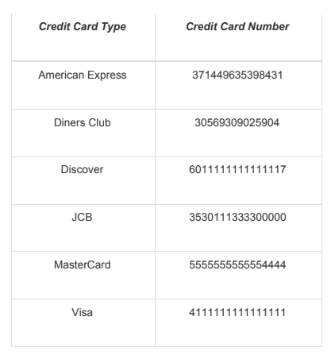

# El prototipo de importador de contactos:

## Criterios de entrega:

* Formato de entrega: repositorio en Github o Bitbucket con un README con las instrucciones de cómo ejecutar el
  software, un usuario de pruebas y uno o varios archivos .csv para pruebas.
* Deployment en una app hobby de heroku o a un servidor similar de pruebas.
* La aplicación debe permitir a los usuarios montar archivos de contactos en formato CSV y procesarlos con el propósito
  de generar un archivo unificado de contactos.
* Los contactos estarán asociados al usuario que los importó dentro de la plataforma.
* Al momento de cargar los archivos, la aplicación debe validar que los campos que se ingresaron están bien formateados.
* Debes tener en cuenta que los archivos pueden tener muchos registros.
* Buenas prácticas PSR12 / SOLID / PhpDOC

### El prototipo de importador de contactos:

* Como usuario debe poder ingresar al sistema usando un correo y un password (usar por ejemplo laravel jetstream).
* Como usuario debe poder registrarme en la plataforma. Para esto solo será necesario colocar usuario y contraseña.
* Como usuario debe poder montar un archivo CSV para procesar. Al momento de montar un archivo, el usuario deberá
  escoger qué columna pertenece a qué información específica de contacto, es decir el usuario debe emparejar las
  columnas del archivo con la información que se va a procesar y luego guardar en la base de datos. Esto quiere decir
  que en los CSV's las columnas con información no va a ser estándar y pueden llegar en orden o con nombre diferentes a
  los que se usarán en la base de datos.

**En la base de datos se debe guardar los siguientes valores:**

* Nombre
* Fecha de Nacimiento
* Teléfono
* Dirección
* Tarjeta de Crédito
* Franquicia
* Email

### Validaciones

Como sistema debe procesar el contenido del archivo CSV. Las siguientes validaciones deben tener los elementos en el
CSV (todos los datos son obligatorios).

* Nombre: Los nombres que tengan caracteres especiales, excepto él menos(-) serán valores inválidos y no se podrán
  guardar.
* Fecha de Nacimiento: El sistema solo aceptará dos tipos de formatos de fecha ISO 8601 (%Y%m%d) y (%F). Toda fecha que
  no tenga esos formatos Importador de Contactos no será guardada. Al final la fecha se debe mostrar con el formato
  siguiente Year Month Day ósea 1985 enero 4.
* Teléfono: Los formatos válidos de teléfono son (+00) 000 000 00 00 por ejemplo (+57) 320 432 05 09 y (+00)
  000-000-00-00 (+57) 320-432-05-09 todo número que no cumpla este formato deberá ser ignorado.
* Dirección: La dirección no tiene formatos válidos por lo que lo único que se debe validar es que no estén vacíos.
* Tarjeta de Crédito: Con la tarjeta de crédito se deben hacer dos procesos, el primero es obtener la franquicia a la
  que pertenece, para esto debemos usar el IIN con los números de la tarjeta como se explica
  aquí https://en.wikipedia.org/wiki/Payment_card_number#Major_Industry_Identifier_.28MII.29. En la tabla de abajo
  puedes ver ejemplos para cada franquicia vigente. El segundo proceso es encriptar el número de tarjeta de crédito,
  para esto debes validar la longitud de la tarjeta sea la correspondiente y encriptar el número con algún método que no
  sea recuperable. Debes recordar que al momento de mostrar la tarjeta en la pantalla final solo debes mostrar los
  últimos 4 números.
* Franquicia: La franquicia se debe identificar a partir del número de la tarjeta de crédito.
* Email: Solo se debe validar que el email sea válido y que por cuenta asociada solo puede haber un email. Esto quiere
  decir que el usuario A tiene como contacto a ejemplo@gmail.com y el usuario B tiene como contacto a ejemplo@gmail.com,
  pero ni el usuario A ni el B pueden tener el mismo correo repetido.

* Como usuario debe poder ver un registro de los contactos que he importado. Todos los contactos que he importado y que
  fueron creados satisfactoriamente deben por verse en una lista que esté paginada.
* Como usuario debe poder ver un registro de los contactos que no pudieron ser importados y el error asociado a él.
* Como usuario debe poder ver una lista de archivos importados con su respectivo estado, estos estados válidos son:
    * En espera: es cuando se subió el archivo, pero aún no se ha comenzado a procesar
    * Procesando: es cuando efectivamente se esté leyendo el archivo y realizando las acciones requeridas arriba
    * Fallido: es cuando no se pudo importar ni un solo contacto por errores en los datos (Si el archivo de contactos
      está vacío no debería considerarse como fallido)
    * Terminado: es cuando se ha procesado todo el archivo y se ha registrado al menos un contacto en la base de datos

De ser posible: subir los archivos procesados a un bucket en S3 y asociar un link de acceso al archivo en el sistema
